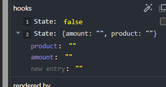
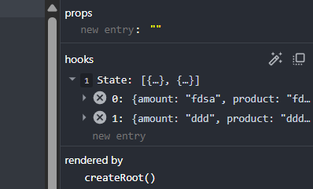
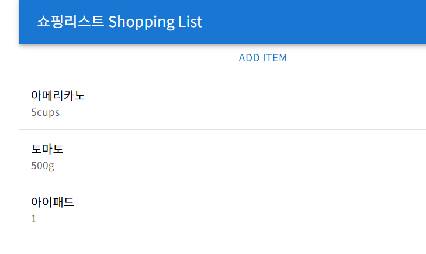

### react component site
https://github.com/brillout/awesome-react-components

1. 컴포넌트들은 README에서 볼 수 있듯이 npm을 통해서 설치가 가능합니다.

- 설치ㅣ 방법 :
`npm install component_name@version`
`npm install react-date-picker@10.0.3`
- 설치된 컴포넌트를 리애그 앱에서 제거하는 명령어
`npm uninstall componenet_name`
`npm uninstall react-date-picker`
- 업데이트가 누락된 컴포넌트들을 전부 다 검색하는 명령어
`npm outdated`
- 업데이트 누락된 컴포넌트들을 일괄 업데이트하는 명령어
`npm update`
- 모든 프로젝트 의존성 목록을 가져오는 명령어
`npm list`

# AG Grid
`npm install ag-gird-community@.1.0 ag-grid-react@30.1.0`


AG Grid는 리액트 앱을 위한 데이터 그리드 컴포넌트입니다.
- 스프레드 시트처럼 데이터를 표시하는 데 이용하며, 상호작용도 가능합니다.
- 필터링 / 정렬 / 피벗과 같은 기능들을 포함했습니다.

```tsx
import { useState } from "react";
import "./App.css";
import axios from "axios";
import { AgGridReact } from "ag-grid-react";
import "ag-grid-community/styles/ag-grid.css";
import "ag-grid-community/styles/ag-theme-material.css";

type Repository = {
  id: number;
  full_name: string;
  html_url: string;
};

function App() {
  const [keyword, setKeyword] = useState("");
  // 다수 결과값으로 나올 수 있음<Repository[]>
  // 배열을 담아줄 상태 값([])
  const [repodata, setRepodata] = useState<Repository[]>([]);

  const handleClick = () => {
    // item의 자료형 : repository 배열
    axios
      .get<{ items: Repository[] }>(
        `https://api.github.com/search/repositories?q=${keyword}` // repodata - 아래에서 set 해줌
      )
      .then((response) => setRepodata(response.data.items))
      .catch((error) => console.log(error));
  };

  return (
    <div className="App">
      <input
        type="text"
        onChange={(e) => setKeyword(e.target.value)}
        value={keyword}
      />
      <button onClick={handleClick}>Search💫</button>
      <div className="ag-theme-material" style={{ height: 500, width: 850 }}>
        <AgGridReact rowData={repodata} />
      </div>

      {/* <ul style={{marginTop: "20px"}}>
        {repodata.map((repo) => (
          <li key={repo.id}>
            <a href={repo.html_url} target="_blank">{repo.full_name} : {repo.html_url}</a>
          </li>
        ))}
      </ul> */}
    </div>
  );
}

export default App;
```

```tsx
import { AgGridReact } from "ag-grid-react";
import "ag-grid-community/styles/ag-grid.css";
import "ag-grid-community/styles/ag-theme-material.css";
```
이상의 import 문들은 ag-grid 컴포넌트 자체와 스타일시트를 가지고 왔습니다. 그 중에서도 86번 라인은 google에서 권장하는 material style을 가지고 왔음을 뜻합니다.

그러니까 사전 정의 스타일을 가지고 옴으로써 css를 최소화 했습니다. 
그런데 styles/ag-grid.css 를 통해 최소한의 커스터마이징도 할 수 있는데, 이를 style{{height:500, width:850}} 으로 처리했습니다.

그리고 return문에 AgGridReact 컴포넌트

그리고 a 아... 선생님 git 보기

```tsx 
  return (
    <div className="App">
      <input
        type="text"
        onChange={(e) => setKeyword(e.target.value)}
        value={keyword}
      />
      <button onClick={handleClick}>Search💫</button>
      <div className="ag-theme-material" style={{ height: 500, width: 850 }}>
        <AgGridReact rowData={repodata} />
      </div>
```

이상과 같은 return 문이 작성되었습니다.

그 다음 과정으로 ag-grid에 이용될 컬럼을 정의할겁니다. 컬럼 정의 객체의 배열에 해당하는 columDefs가는 상태를 정의할겁니다. 그리고 ag-grid는 여기에 이용할 수 있는 ColDef 타입을 제공합니다.(TypeScript로 쓰는 이유). 컬럼 객체에서는 필수 field 프롭을 이용하여 데이터 접근자를 정의해야하는데, 여기서는 field 값이 컬럼이 표시해야 하는 REST API 응답 데이터의 속성 이름이 될겁니다.

```tsx
import { useState } from "react";
import "./App.css";
import axios from "axios";
import { AgGridReact } from "ag-grid-react";
import "ag-grid-community/styles/ag-grid.css";
import "ag-grid-community/styles/ag-theme-material.css";
import { ColDef, ICellEditorParams } from "ag-grid-community";

type Repository = {
  id: number;
  full_name: string;
  html_url: string;
};

function App() {
  const [keyword, setKeyword] = useState("");
  // 다수 결과값으로 나올 수 있음<Repository[]>
  // 배열을 담아줄 상태 값([])
  const [repodata, setRepodata] = useState<Repository[]>([]);
  const [columnDefs] = useState<ColDef[]>([
    { field: "id", sortable: true, filter: true }, // 컬럼1
    { field: "full_name", sortable: true, filter: true }, // 컬럼2
    { field: "html_url", sortable: true, filter: true }, // 컬럼3
    {
      field: 'full-name',
      cellRenderer: (params: ICellEditorParams) => (
        <button onClick={() => alert(params.value)}>
          Press me!💫
        </button>
      )
    }
  ]); // typeScript 배열이니까 배열로 초기값 / 객체니까 {}

  const handleClick = () => {
    // item의 자료형 : repository 배열
    axios
      .get<{ items: Repository[] }>(
        `https://api.github.com/search/repositories?q=${keyword}` // repodata - 아래에서 set 해줌
      )
      .then((response) => setRepodata(response.data.items))
      .catch((error) => console.log(error));
  };

  return (
    <div className="App">
      <input
        type="text"
        onChange={(e) => setKeyword(e.target.value)}
        value={keyword}
      />
      <button onClick={handleClick}>Search💫</button>
      <div className="ag-theme-material" style={{ height: 500, width: 850 }}>
        <AgGridReact
          rowData={repodata}
          columnDefs={columnDefs}
          pagination={true}
          paginationPageSize={5}
        />
      </div>

      {/* <ul style={{marginTop: "20px"}}>
        {repodata.map((repo) => (
          <li key={repo.id}>
            <a href={repo.html_url} target="_blank">{repo.full_name} : {repo.html_url}</a>
          </li>
        ))}
      </ul> */}
    </div>
  );
}

export default App;

```
이상에서 컬럼의 정의 및 거기에 딸려있는 properties를 확인했습니다. sortable / filter였고, 그 다음에 추가적인 컬럼을 정의했는데, 거기에 cellRenerer라는 속성이 있습니다.

그리고 pagenation / pagenationPageSize는 `<AgGridReact>`컴포넌트 내부에 정의했었습니다.
retrun문과 colDefs 상태를 둘 다 잘 확인하시기 바랍니다.

cellRenderer 프롭을 이용하면 테이블 셀의 컨텐츠를 사용자 정의할 수 있습니다. 이상의 예시에서는 Ag Grid 내의 컬럼에서 버튼을 렌더링하는 예시였습니다.

ellRenderer 속성의 value는 callback 함수롤 이루어져있습니다. 그리고 매개변수로 params를 받았고, ICellRenderParams Type으로 작성했고, params.value의 값은 field 속성에 정의된 full_name을 썼습니다. 그래서 버튼 누르면 full_name이 출력되었었습니다.

근데 보니까 컬럼 이름이 너무 대놓고 field와 동일하게만 되어있습니다. 그러다보니까 column명 화가인해보시면 Id / Full_name / Html_url / Full_name 으로 Full_name 컬럼이 두 개인 것을 확인할 수 있습니다. 이를 수정하기 위해서는 `headerName` 속성을 활용할 수 있습니다.

# Meterial UI Component 이용
### shopping list

```tsx
import { AppBar, Container, Toolbar, Typography } from "@mui/material";
import "./App.css";

function App() {
  return (
    <Container>
      <AppBar position="static">
        <Toolbar>
          <Typography variant="h6">
            쇼핑리스트 Shopping List
            </Typography>
        </Toolbar>
      </AppBar>
    </Container>
  );
}

export default App;
```
이상에서 주의깊게 보셔야할 부분은 각 컴포넌트가 무슨 역할을 하는지 입니다.
Container : 전체 브라우저 화면을 의미
AppBar : 상단을 의미
Toolbar : nav와 비슷한 역할
Typography : 글씨 관련 영역을 나타냄

이하부터는 실제 shopping list 의 기능과 관련된 부분을 작성할 예정

당연히 MUI를 도입한 부분이 될 것이기 때문에 일반적인 html + js + react의 형태로는 어떻게 작성될 수 있을지 감안한 상태에서 코드를 확인해야한다.

```tsx
import {
  Button,
  Dialog,
  DialogActions,
  DialogContent,
  DialogTitle,
  TextField,
} from "@mui/material";
import { useState } from "react";

function AddItem(props) {
  // 인풋창에 입력하게 되면 여기 컴포넌트로 넘어와야하기 때문
  const [open, setOpen] = useState(false);

  const handleOpen = () => {
    setOpen(true);
  }

  const handleClose = () => {
    setOpen(false);
  }

  return (
  <>
  </>
  );
}

export default AddItem;
```

App 컴포넌트 내에 AddItem 컴포넌트를 추가할겁니다. 그런데 저희 todolist 때는 input 창에 button 하나만 있었습니다.
그리고 github api 가지고 올 때도 그랬었구요. 이번에는 Modal이라고 하는 개념을 추가할겁니다.

근데 이 Modal을 저희가 처음 배우는건 아니고 1만시간의 법칙에서 했었습니다.

폼에 product와 amount라는 두 개의 입력 필드와 App 컴포넌트 내에 addItem 함수를 호출하는 버튼을 추가할겁니다. _App 컴포넌트에 있는 addItem 함수를 호출할 수 있으려면 addItem 컴포넌트를 렌더링할 때 프롭으로 전달_ 해야합니다. 모달 Dialog 컴포넌트 외부에 사용자가 새 쇼핑하ㅏㅇ목을 입력할 수 있는 모달 폼을 여는 버튼을 추가해둘겁니다. 해당 버튼은 컴포넌트가 처음 렌더링 될 때 보이는 유일한 요소에 해당될겁니다.

즉 최초에 open 상태가 false이기 때문에 모달 폼은 보이지않고, 버튼만 보일것이라는 의미입니다.

```tsx
import {
  Button,
  Dialog,
  DialogActions,
  DialogContent,
  DialogTitle,
  TextField,
} from "@mui/material";
import { useState } from "react";
import { Item } from "./App";

function AddItem(props) {
  // 인풋창에 입력하게 되면 여기 컴포넌트로 넘어와야하기 때문
  const [open, setOpen] = useState(false);
  const [item, setItem] = useState<Item>({
    product: "",
    amount: "",
  });

  const handleOpen = () => {
    setOpen(true);
  };

  const handleClose = () => {
    setOpen(false);
  };

  return (
    <>
      <Button onClick={handleOpen}>
        Add Item
        </Button>
      <Dialog open={open} onClose={handleClose}>
        <DialogTitle>
          New Item
          </DialogTitle>
        <DialogContent>

        </DialogContent>
        <Button onClick={handleClose}>
          Calcel / 취소
          </Button>
        <Button onClick={addItem}>
          {/* addItem = app.tsx에 정의 되어있음 */}
          Add / 저장
        </Button>
      </Dialog>
    </>
  );
}

export default AddItem;

```
이상에서 알단 주의해서 봐야할 점은 App.tsx에 정의되어있는 type인 Item을 가지고 왔다는 점입니다. 이 것은 프로젝트의 사이즈가 매우 작기 때문이고, 보통은 type.ts 파일에 전체 타입들이 정의도어있고, 거기서 가지고 오게 될겁니다.

그리고 addItem함수가 App.tsx에 정의되어있지만, AddItem 컴포넌트에서 불러오고 있습니다. 이 부분에 대해서 의문을 가질 수 있습니다.

1. AddItem 컴포넌트 내에 addItem 함ㅁ수를 정의하면 안되는가.
  - App.tsx의 addItem 함수를 확인하면 Item이 추가되고, 기존의 items들을 그대로 스프레드 연산자로 받아온다는 것을 확인할 수 있습니다.
  - 여기서 중요한 점은 AddItem 컴포넌트에서 하나의 item을 추가한 것을 상위로 보낼 방법이 없다는 점입니다.
  - React에서의 Data Flow는 상위-> 하위로 이어지는 Top-Down 형식이기 때문입니다. 즉 AddItem 컴포넌트에서 추가하는 함수를 별개로 만들어봐ㅏㅆ자 App 컴포넌트로 보낼 수 없기 때문에 결과적으로 App 컴포넌트에서 addItem 함수를 만들고, _해당 함수를 호출하는 함수를 AddItem 컴포넌트에 정의_ 해야한다고 생각할 수 있겠습니다.
  - React에서의 기초적인 원리 부분에서 One-way data flow 에 대해 강조한 이유가 나오는 부분 중 하나입니다.
  - 이게 너무 머리아프면 Recoil / ContextAPI 등의 전역 상태 관리를 통해서 함수를 전부 다 전역에 등록해서 불러오는 방법도 고려할 수 있습니다.


AddItem 에는 초기화 되더라도(입력되는 창이기 때문)



App 내에는 계속 저장되고 있음

```tsx
import {
  Button,
  Dialog,
  DialogActions,
  DialogContent,
  DialogTitle,
  TextField,
} from "@mui/material";
import { useState } from "react";
import { Item } from "./App";

type AddItemProps = {
  addItem: (item: Item) => void; //매개변수는 있는데 결과는 void
};

function AddItem(props: AddItemProps) {
  // 인풋창에 입력하게 되면 여기 컴포넌트로 넘어와야하기 때문
  const [open, setOpen] = useState(false);
  const [item, setItem] = useState<Item>({
    // App.tsx의 Item을 불러옴
    product: "",
    amount: "",
  });

  const handleOpen = () => {
    setOpen(true);
  };

  const handleClose = () => {
    setOpen(false);
  };

  // App.tsx의 addIitem 함수를 호출하고, item 상태를 전달
  const addItem = () => {
    props.addItem(item); // item 가지고와줌
    // TextField에 있는 내용을 다 지우고 Modal을 띄움
    setItem({ product: "", amount: "" });
    handleClose();
  };

  return (
    <>
      <Button onClick={handleOpen}>Add Item</Button>
      <Dialog open={open} onClose={handleClose}>
        <DialogTitle>New Item</DialogTitle>
        <DialogContent>
          <TextField // input 창을 대신
            value={item.product}
            margin="dense"
            onChange={(e) => setItem({ ...item, product: e.target.value })}
            label="Product/제품명"
            fullWidth
          />
          {/* amount 값은 유지가 되야하기 때문에 스프레드 연산자 사용 */}
          <TextField
            value={item.amount}
            margin="dense"
            onChange={(e) => setItem({ ...item, amount: e.target.value })}
            label="Amount/수량"
            fullWidth
          />
        </DialogContent>
        <Button onClick={handleClose}>Calcel / 취소</Button>
        <Button onClick={addItem}>
          {/* addItem = app.tsx에 정의 되어있음 */}
          Add / 저장
        </Button>
      </Dialog>
    </>
  );
}

export default AddItem;
```
이상의 코드에서 props로 전달하는 함수 부분에 주목하셔야합니다. 이를 위해 AddItemProps라는 type을 선언했습니다.

마찬가지로 
App.tsx도 확인해야합니. 함수를 전달하기 위한 방식이었습니다.

```tsx
import { AppBar, Container, Toolbar, Typography } from "@mui/material";
import "./App.css";
import { useState } from "react";
import AddItem from "./AddItem";

// 내부에서 쓰려고 export - 직접 정의한 자료형
export type Item = {
  product: string;
  amount: string;
};

function App() {
  const [items, setItems] = useState<Item[]>([]);
  const addItem = (item: item) => {
    setItems([item, ...items]);
    // 뒤에 스프레드 문법 = 가장 최근에 있는거 먼저 추가 + 기존꺼 추가
    // 스프레드 문법은 배열, 객체 안에서 사용 가능함
  };

  return (
    <Container>
      <AppBar position="static">
        <Toolbar>
          <Typography variant="h6">쇼핑리스트 Shopping List</Typography>
        </Toolbar>
      </AppBar>
      <AddItem addItem={addItem} />
      {/* 속성명=내부정의 함수 */}
    </Container>
  );
}

export default App;
```

그렇다면 현재까지 작성한 것을 기준으로 했을 때 App.tsx에 있는 items 상태가 업데이트 된다는 것을 확인할  수 있습니다.

근데 그 업데이트 된 items를 보여주지 못하고 있네요,
그럼 업데이트된 items의 결과를 보여주는 return 부분에서의 코드가 있어야 할 것 같습니다.


최근 값이 위로 추가됨

```tsx
import {
  AppBar,
  Container,
  List,
  ListItem,
  ListItemText,
  Toolbar,
  Typography,
} from "@mui/material";
import "./App.css";
import { useState } from "react";
import AddItem from "./AddItem";

// 내부에서 쓰려고 export - 직접 정의한 자료형
export type Item = {
  product: string;
  amount: string;
};

function App() {
  const [items, setItems] = useState<Item[]>([]);
  const addItem = (item: item) => {
    setItems([item, ...items]);
    // 뒤에 스프레드 문법 = 가장 최근에 있는거 먼저 추가 + 기존꺼 추가
    // 스프레드 문법은 배열, 객체 안에서 사용 가능함
  };

  return (
    <Container>
      <AppBar position="static">
        <Toolbar>
          <Typography variant="h6">쇼핑리스트 Shopping List</Typography>
        </Toolbar>
      </AppBar>
      <AddItem addItem={addItem} />
      {/* 속성명=내부정의 함수 */}
      <List>
        {items.map((item, index) => (
          <ListItem key={index} divider>
            <ListItemText primary={item.product} secondary={item.amount} />
          </ListItem>
        ))}
      </List>
    </Container>
  );
}

export default App;
```
이상에서 확인해야 하는 짐은 기보적으로 items 상태를 업데이트 하는 부분이 어느 부분에 작성되어야 하는가입니다. 구조는 현재 
App
⬇️
AddItem
컴포넌트 구조로 됭있습니다. 즉, App 컴포넌트에 items 결과값을 표시할것이냐, AddItem 컴포넌트에 표시할것이냐 1/2 확률이라고 볼 수 있다.

심플하게 생각해봤을 때, items 상태가 정의돤곳은 App이다.
그래서 App에 결과값 표시했습니다.

List 컴포넌트를 App 컴포넌트 내에서 랜더링했습니다. 지금 현재까지 MUI를 보시면 위계가 잡혀있다는 것을 알 수 있습니다.
List -> ListItem -> ListItemText
ul -> li
List 내에서 map() 함수를 활용하여 ListItem 컴포넌트를 생성했습니다(ul 내부에서 map함수 써서 li를 써서 만든 것과 동일). 배열이기 때문에 key 프롭이 요구되는 것도 동일합니다.
`<ListItem key={index} divider>` 에서 보시면 divider라는 속성이 있는데 얘는 각 항목 끝 부분에 구분선을 가지고 옵니다.
다음에 ListItemText에서 기본 텍스트로 product를 표시하고, 보조 텍스트로 amount 를 표시했습니다. 각각 primary / secondary로 쓰였습니다. MUI에서 자주 쓰이는 속성입니다.


또한 button의 스타일이 있는데 `<Button onClick={handleOpen} variant="outlined">`로 쓸 수 있습니다,

이상의 MUI라이브러리를 사용하면 링액트 앱에서 일관되게 디자인 하는것이 가능하다. 그리고 좋은 점은 프로젝트를 찍어낼 때 CSS를 고려할 필요성이 덜하다

하지만 기본값이 정해져있는만크 커스터마이징을 하기 위해서는 emotion이나 tailwind를 고려할 필요도 있습니다.

# React Router

설치 버전 
npm install react-router-dom@6

React Router란 URL을 기반으로 특정 컴포넌트를 렌더링할지 정의할수 있는 방식

react-router-dom 라이브러리는 라우팅을 구현하는 데 이용되는 컴포넌트들을 제공합니다.
1. BrowserRouter : 웹 기반 애플리케이션을 위한 라우터(엔드 포인트)
2. Route : 주어진 위치가 일치하면 정의된 컴포넌트를 렌더링
이하는 Route 컴포넌트의 예시인데, element 속성은 사용자가 path 프롭엥 정의된 contact 엔드포인트로 이동할 때 렌더링되는 컴포넌트를 정의합니다.
경로는 현재 위치를 기준으로 상대 경로를 작성합니다.
`<Route path="contact" element={<Contact />} />` 혹은 이하와 같이 path 속성 끝에 * 와일드 카드를 이용하는 것도 가능합니다.(PermitAll 같은거)
`<Route path="contact/*" element={<Contact />} />`
그러면 contact/mike 혹은 contact/1 등의 엔드포인트들에 전부 다 Contact 컴포넌트가 렌더링됩니다.
또한, Route 컴포넌트는 여러 Route 컴포넌트를 감싸는 것이 가능합니다. 이를 위해서 Link 컴포넌트는 애플리케이션에 대한 탐색 기능을 제공하는데, 이하의 예시는 Contact 링크를 표시하며, 해당 링크를 클릭했을 때 `/contact` 엔드포인트로 이동합니다.
`<Link to="contact">Contact</Link>`


```tsx

//App.tsx
import { BrowserRouter, Link, Route, Routes } from "react-router-dom";

import "./App.css";
import Home from "./Home";
import Contact from "./Contact";
import PageNotFound from "./PageNotFound";
import ContactSeoul from "./ContactSeoul";
import ContactBusan from "./ContactBusan";

function App() {
  return (
    <>
      <BrowserRouter>
        <nav>
          {/* 특정 엔드포인트일 때 특정한 컴포넌트 불러와줌 */}
          <Link to="/">Home</Link>
          {" | "}
          <Link to="/contact">Contact</Link>
        </nav>
        {/* Route 는 Routes에 감싸져있어야함 */}
        <Routes>
          <Route path="/" element={<Home />} />
          <Route path="/contact" element={<Contact />}>
            <Route path="seoul" element={<ContactSeoul />} />
            <Route path="busan" element={<ContactBusan />} />
          </Route>

          <Route path="*" element={<PageNotFound />} />
        </Routes>
      </BrowserRouter>
    </>
  );
}

export default App;

// Contact.tsx
import { Link, Outlet } from "react-router-dom";

function Contact() {
  return (
    <>
      <h3>Contact Us!💫</h3>
      <nav>
        <Link to="seoul">서울 지점</Link>
        {" | "}
        <Link to="busan">부산지점</Link>
      </nav>
      <hr />
      <Outlet/>
     </>   
  );
}

export default Contact;

```
`<Outlet/>` : 중첩 라우트(Nested Routes)를 렌더링하기 위해 사용하는 일종의 자리 표시자(placeholder)입니다.

그러니까 Outlet 컴포넌트가 있는 장소에 해당 자식 컴포넌트를 불러내주세요, 라는 의미가 됩니다.

그러면 이상의 코드에서 보셨던거서럼 App.jsx의 `<Route path="/contact" element={<Contact />}>` 의 내부에 seoul과 busan 엔드포인트를 지정했고, 거기에 ContactSeoul과 ContactBusan을 명시하는 것이 아니라 `<Outlet />` 컴포넌트를 통해서 불러온다고 생각하시면 됩니다.

이상의 라이브러리를 이용할 경우 컴포넌트들이 하나의 URL(예를 들어 localhost:5173)만 가지는 것이 아니라 각각의 다른 URL을 가지도록 통제하여 필요한 부분만을 렌더링할 수 있도록 합니다.

# 금일 현재까지의 학습 내용 요약
1. 3rd party 컴포넌트들을 학습했습니다.
  - react-date-picker는 그냥 설치하는 방법 보여드렸습니다
  - AgGrid를 이용했습니다.
    - 테이블을 대체하는 컴포넌트
      - filter, sort, column 정의와 관련된 부분을 학습했습니다.
    - MUI 컴포넌트
      - 이상에서 중요한 것은 HTML 태그에 해당하는 컴포넌트들이 존재한다는 점입니다.
        - `<input>` 태그를 대체하느느 것은 `<TextField>` 인 등 
        - 내부에 MUI 자체 property가 있기 때문에 학습 필요성이 있습니다,
        - 귀찮게 하나하나 학습할거면 왜 쓰냐 싶은데 CSS보다 쉬움
      - react-router-dom
        - SPA 상에서 하나의 URL이 아니라 다수의 URL을 다루는 방식을 학습했습니다.
        - 조건부 렌더링이 if 문이나 삼항연산자를 쓰는 것 뿐만 아니ㅣ라, 내부의 URL을 기준으로 서로 다른 컴포넌트를 렌더링할 수 있도록 하는 방식이었습니다.

외부 라이브러리를 다루는 현재 시점에서는 수업 자체보다 공식문서의 활용이 매우 중요합니다 여러분들이 프로젝트 때 어떤 라이브러리를 다루게 될 지 모르니까.

# Full Stack 개발 - 스프링부트 RESTful API 웹 서비스를 위한 프론트엔드 
## UI prototype
1. 데이터베이스의 자동차를 테이블에 나열하고, 페이징, sorting, filtering 기능을 구현할겁니다. - AG Grid를 써서
2. 데이터베이스에 새 차량을 추가할 수 있는 모달 폼을 여는 버튼을 구현할겁니다, - MUI를 사용해서
3. 차량 테ㅣ블의 각행에 자동차ㅏ를 편집하거나 데이터베이스에서 삭제하는 버튼을 구현할겁니다, AG Grid에 있었는데, 거기에 버튼을 클릭해쓸 대 특정 함수가 호출되고, 그게 백엔드로 전달 -> DB로 들어가서 PUT 혹은 DELETE 메서드를 실행시킬겁니다.
4. CSV 파일로 변형하여 내려받기가 가능한 링크 혹은 버튼을 구현해볼까 합니다.

## FrontEnd React 프로젝트 생성
carfront project를 생성합니다